# Moviest

## 📄 Descripción

Esta es una (SPA) que simula un servicio de streaming. Cuenta con una página de login que redirecciona al home al hacer clic en **"Iniciar sesión"**.  
En el home se administran diferentes vistas mediante un menú de navegación estático, con filtros por:

- Categorías
- Películas
- Series
- Favoritos  

También incluye una sección de detalles de cada película.

---

## 🎯 Objetivo

Elaborar un Hub de entretenimiento funcional para aprender y sobre todo demostrar mis habilidades ante Mega

---

## Nombre

Con amor por: Reymundo Fernando Figueroa Romo

---

## 🛠️ Stack Tecnológico

- HTML  
- CSS  
- Angular y TypeScript
- ESLint

---

## 🚀 ¿Cómo instalarlo?

1. Clona este repositorio por HTTPS.
2. Abre la carpeta del repositorio clonado.
3. Ejecuta el comando npm install.
4. Ejecuta en comando ng serve para ejecutar el proyecto

---

## 🎨 Mockup

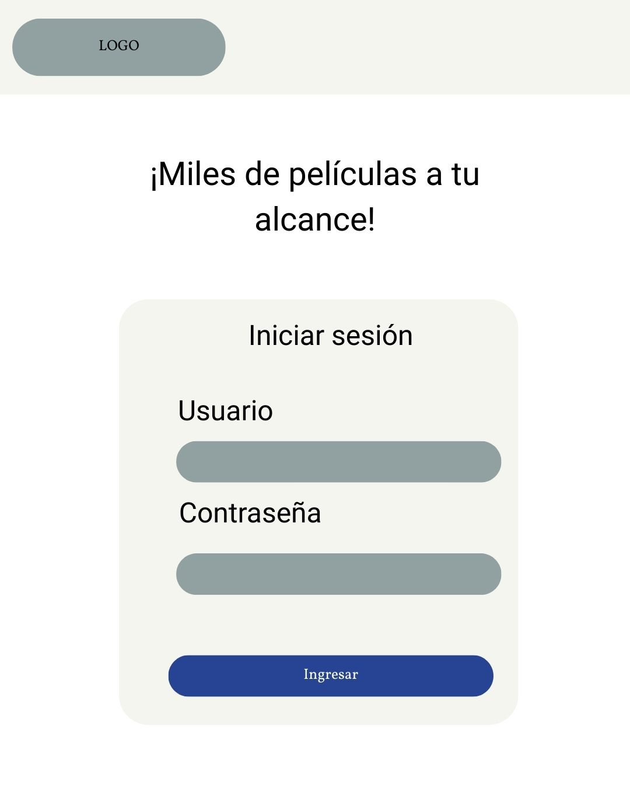
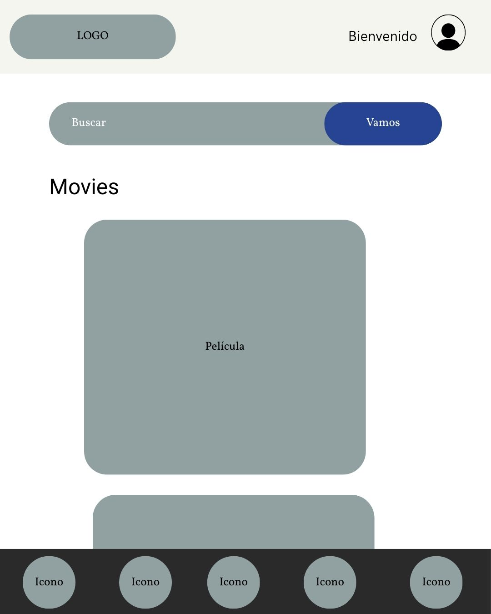
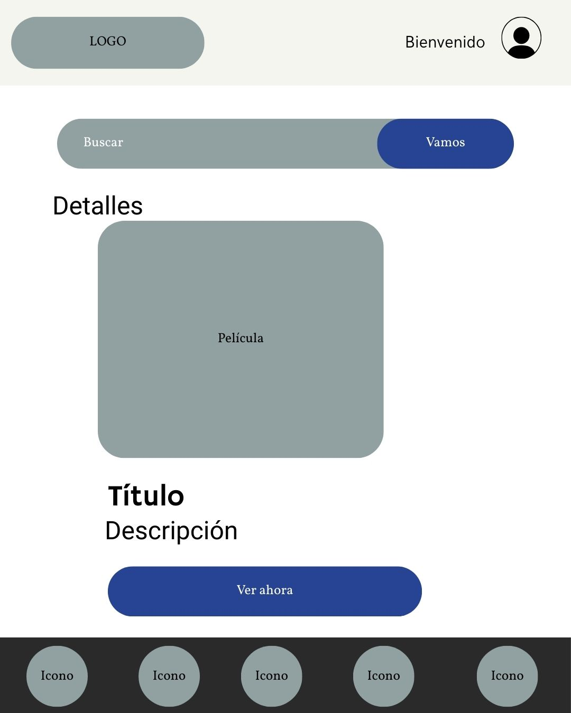

---

## 👀 Vista del proyecto

- Login
Una ventana de login sencilla en la que, para entrar, solo hay que hacer click en ingresar. El esquema de estilos esta inspirado en el Glassmorphism.

- Home
El home consta de las secciones principales:
  - header que muestra el logo, un icono de buscar y un mensaje de bienvenida al usuario
  - una barra de búsqueda con alta visibilidad, pues se espera que en futuras iteraciones sea un
   punto importante para la navegación en la app
  - menú de navegación, este funciona como sistema de navegación para clasificar el contenido en distintas categorías predefinidas
  - Sección de películas, esta sección muestra una lista de películas en las cuales puedes ver detalles agregar o quitar de favoritos en base a los iconos    dispuestos en cada tarjeta
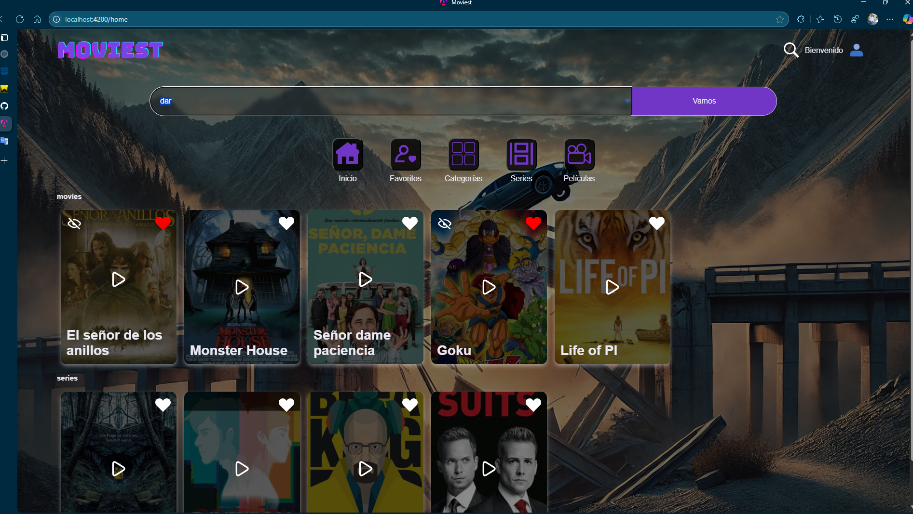
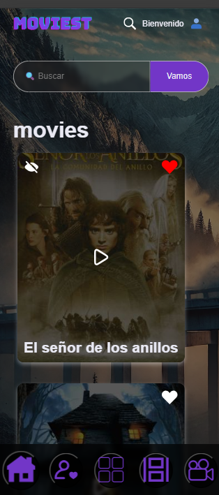
- Favoritos
se accede dando click en el icono de favoritos en el menu de la web, esta muestra películas o series que el usuario haya agregado previamente dando click en el icono del corazón de su respectiva tarjeta, también es posible eliminarlas dando click en el icono de ocultar en la misma tarjeta

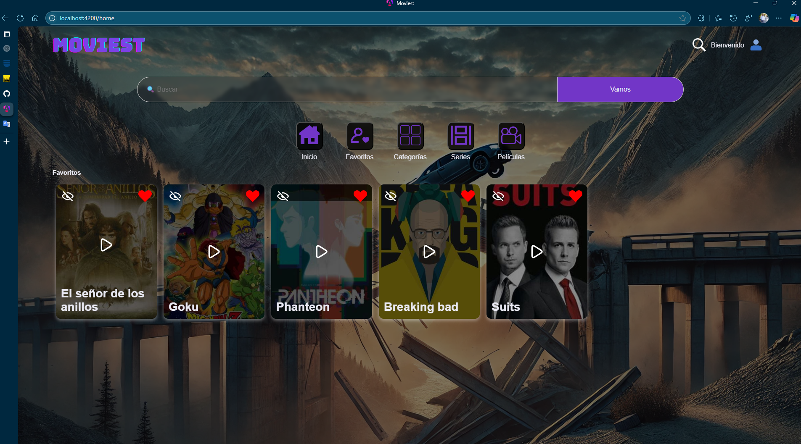

- Categorías
Se accede dando click al icono de categorías y este muestra todas las películas y series según su categoría
actualmente existen las categorías de
  - Acción
  - Misterio
  - Comedia
  - Drama
  - Ciencia Ficción
  - Suspenso

- Detalles de la película
Esta sección muestra los detalles de la película seleccionada, para poder acceder a esta sección hay que hacer click en el icono de la película que se desean conocer los detalles
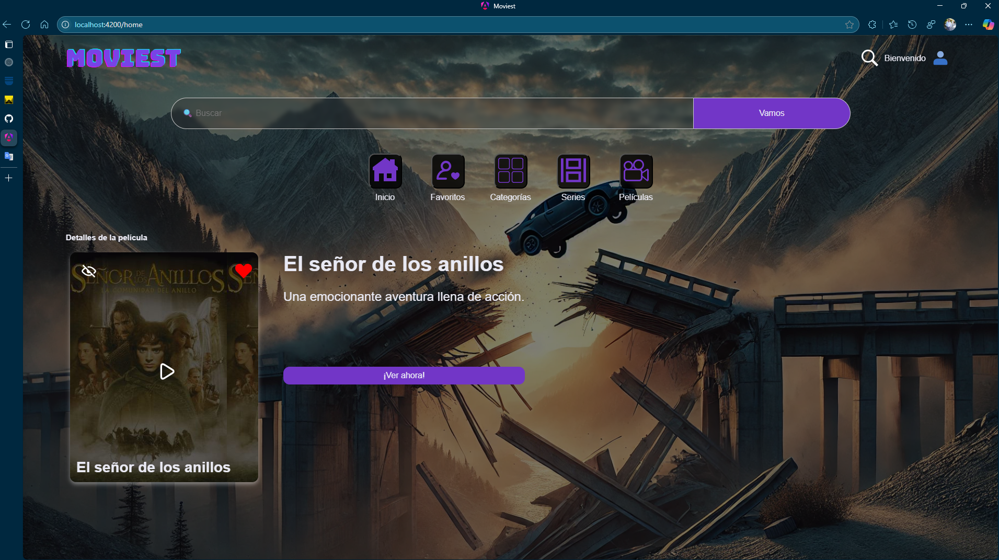
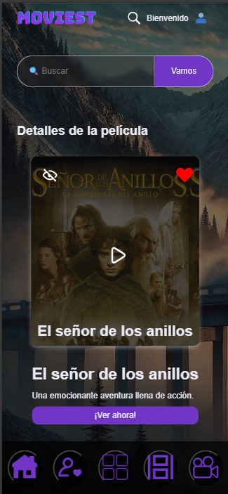

- Barra de búsqueda
Esta sección muestra los resultados de una búsqueda con coincidencias ya sea por titulo o descripción
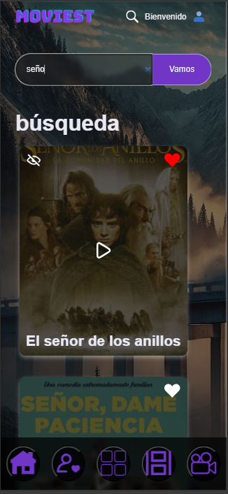

---

## 🛠️ ¿Como lo hice?

1. Realicé los test bajo el método AAA (Arrange, Act, Assert) para tener mayor orden a la hora de desarrollarlos.
2. empece con los test de servicios evaluando su funcionamiento método por método, enfocándome en los returns y el tipo de valor que tendría que retornar.
3. Para los componentes use la misma metodología, solo también añadiendo evaluaciones para los diferentes if que pudiera tener la función.
4. en ambos casos y cuando fuera necesario añadí mocks de las estructuras de datos o métodos que deberían usar, esto mediante el uso de spyOn o el httpTestingModule
5. Ademas añadí funcionalidad a la barra de búsqueda integrando asincronismo y rxjs, utilicé switchMap para manejar los pipe de la búsqueda y eliminar las llamadas anteriores.
6. Use también debounceTime para limitar las llamadas a cada 250 ms
7. use outputs e inputs para transportar la data entre los componentes.

---

## 🐞 Errores conocidos

1. No hay algún elemento de UX para retroceder las listas de películas una vez realizada una búsqueda (se tiene que dar click en algún icono del nav-menu)
2. Solo existe un video hardcodeado para todas las películas
3. Se tuvieron que crear dos estructuras de interfaces para las películas, una para categorías y otra para las demás, lo cual no obedece las mejores practicas

---

## Bibliotecas y dependencias utilizadas

- Rxjs 7.8.0
- typescript-eslint 8.27.0
- eslint 9.23.0
- karma 6.4.0
- angular/common/http 18.2.0 (no logre encontrar el paquete de http en el package.json por que creo que este viene dentro de @angular/common asi que puse la version que esta biblioteca indicaba)

## Reporte de code coverage

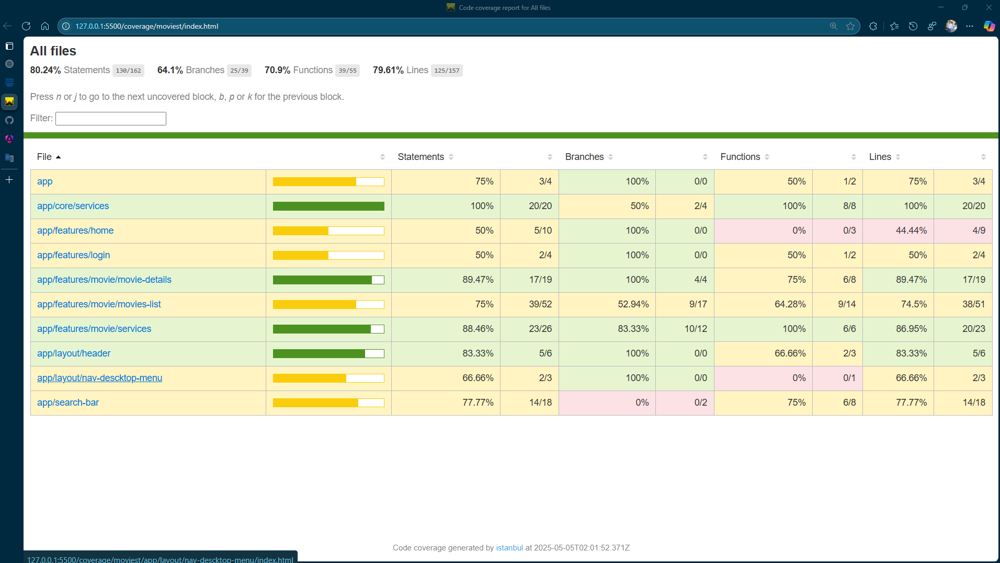
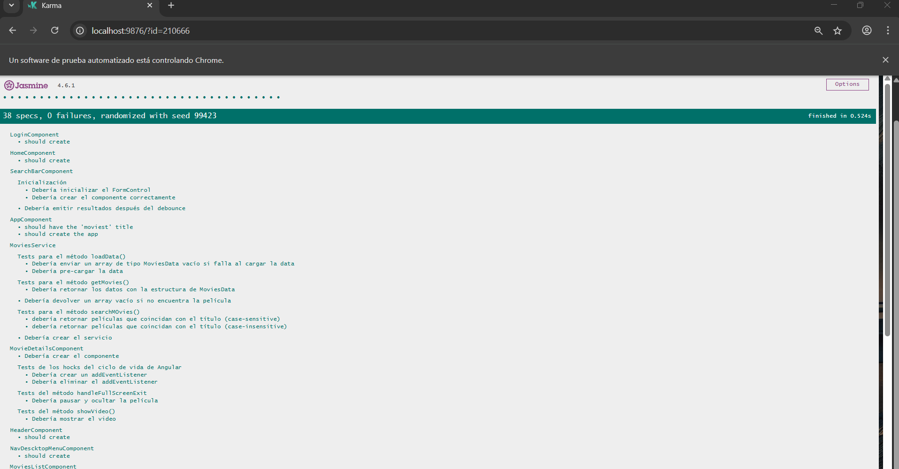

---

## 🔁 Sprint Review

## Retrospectiva

| Categoría               | Descripción                                                                                                                                              |
|-------------------------|----------------------------------------------------------------------------------------------------------------------------------------------------------|
| ¿Qué salió bien?        | - Los tests se pudieron realizar de manera óptima debido a que los métodos estaban bien segmentados.   - Se logró darle funcionalidad a la barra de búsqueda.   - La implementación de RxJS en la barra de búsqueda no presentó grandes problemas. |
| ¿Qué puedo hacer diferente? | - Revisar más a fondo qué librerías y métodos ya están deprecados para el testing.                                                                                 |
| ¿Qué no salió bien?     | - No pude reemplazar el `HttpTestingModule` por una librería más nueva, ya que esta ya está deprecada.                                                  |
