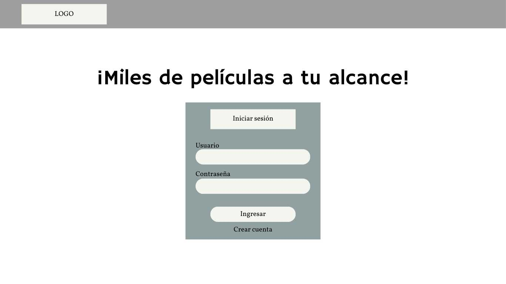
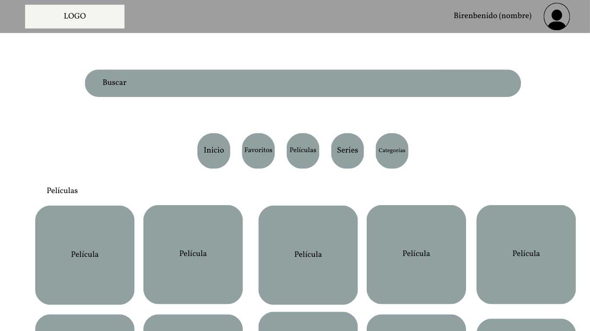
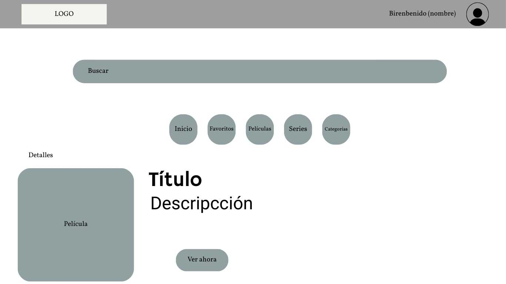
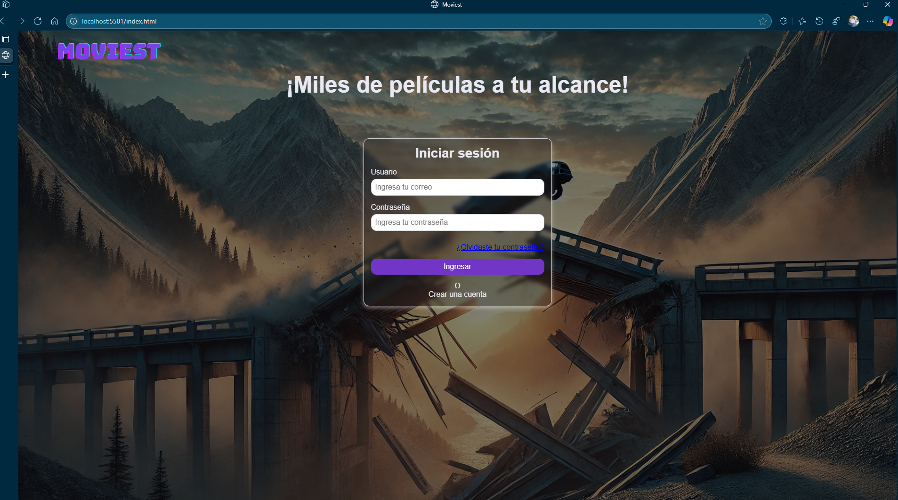
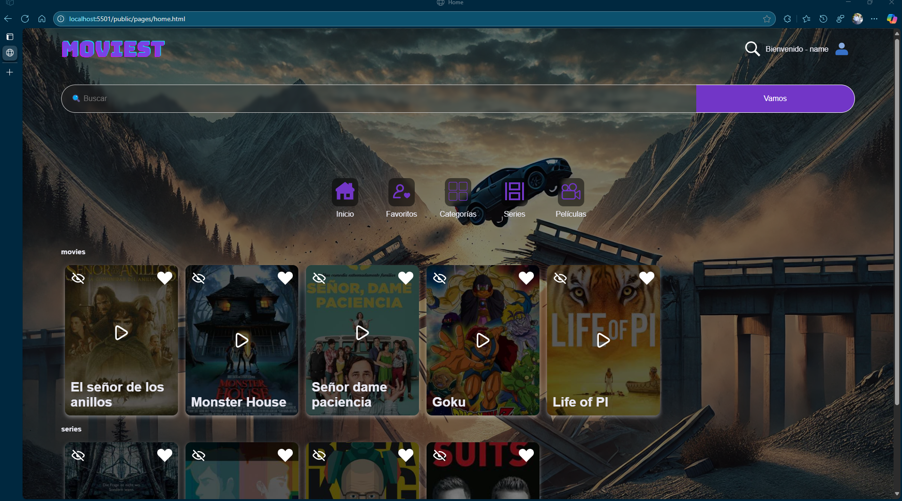
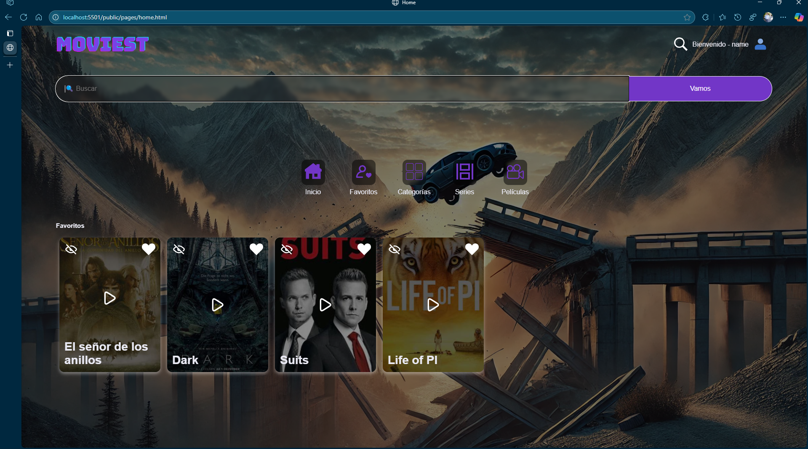
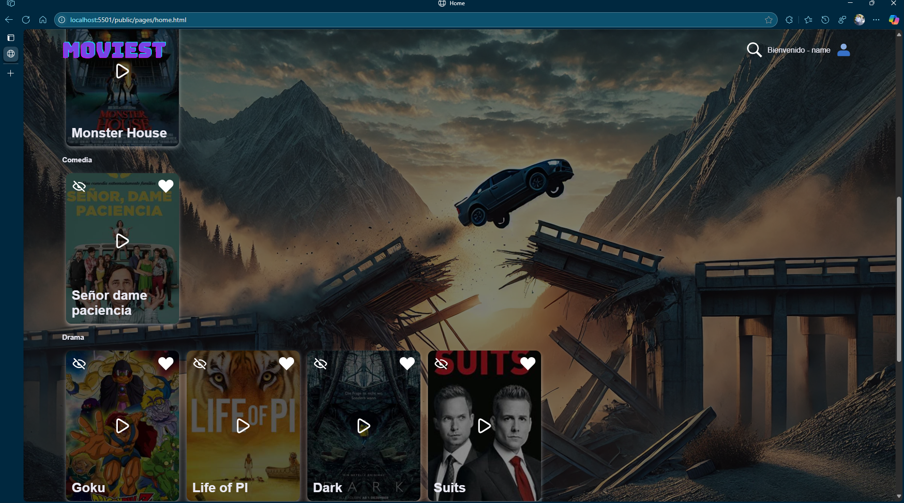
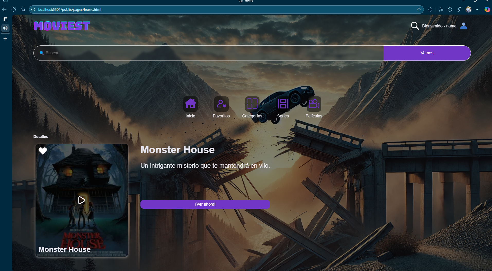

# Moviest

## 📄 Descripción

Esta es una (SPA) que simula un servicio de streaming. Cuenta con una página de login que redirecciona al home al hacer clic en **"Iniciar sesión"**.  
En el home se administran diferentes vistas mediante un menú de navegación estático, con filtros por:

- Categorías
- Películas
- Series
- Favoritos  

También incluye una sección de detalles de cada película.

---

## 🛠️ Stack Tecnológico

- HTML  
- CSS  
- JavaScript Vanilla

---

## 🚀 ¿Cómo instalarlo?

1. Clona este repositorio por HTTPS.
2. Abre la carpeta del repositorio clonado.
3. Ejecuta el archivo `index.html` ubicado en la raíz del proyecto con tu navegador.

---

## 🎨 Mockup

---

## 👀 Vista del proyecto

- Login
Una ventana de login sencilla en la que, para entrar, solo hay que hacer click en ingresar. El esquema de estilos esta inspirado en el Glassmorphism.

- Home
El home consta de las secciones principales:
  - header que muestra el logo, un icono de buscar y un mensaje de bienvenida al usuario
  - una barra de búsqueda con alta visibilidad, pues se espera que en futuras iteraciones sea un
   punto importante para la navegación en la app
  - menú de navegación, este funciona como sistema de navegación para clasificar el contenido en distintas categorías predefinidas
  - Sección de películas, esta sección muestra una lista de películas en las cuales puedes ver detalles agregar o quitar de favoritos en base a los iconos    dispuestos en cada tarjeta

- Favoritos
se accede dando click en el icono de favoritos en el menu de la web, esta muestra películas o series que el usuario haya agregado previamente dando click en el icono del corazón de su respectiva tarjeta, también es posible eliminarlas dando click en el icono de ocultar en la misma tarjeta

- Categorías
Se accede dando click al icono de categorías y este muestra todas las películas y series según su categoría
actualmente existen las categorías de
  - Acción
  - Misterio
  - Comedia
  - Drama
  - Ciencia Ficción
  - Suspenso

- Detalles de la película
Esta sección muestra los detalles de la película seleccionada, para poder acceder a esta sección hay que hacer click en el icono de la película que se desean conocer los detalles

---

## 🛠️ Proceso de creación

1. Se creó un mockup básico de las interfaces.
2. Se maquetaron y estilizaron las páginas con HTML y CSS.
3. Se construyó un objeto con datos de películas y series.
4. Se generó HTML dinámico a partir de los datos con funciones específicas.
5. Se dividió la lógica en:
   - Funciones para renderizar contenido.
   - Funciones manejadoras que reaccionan a eventos y llaman a las funciones de renderizado.
6. Se agregaron funciones para:
   - Detectar clics en íconos de favoritos (añadir/quitar).
   - Detectar clic en el ícono de play (mostrar detalles).
7. Se aplicaron estilos dinámicos a las secciones interactivas.

---

## 🐞 Errores conocidos

1. La barra de búsqueda no funciona.
2. No toda la tarjeta de película es clickeable (solo el ícono de play).
3. No hay indicación visual clara para saber si una película está en favoritos.
4. No se reproduce ningún video por el momento.

---

## 🔁 Sprint Review

| ¿Qué salió bien? | ¿Qué puedo hacer diferente? | ¿Qué no salió bien? |
|------------------|-----------------------------|----------------------|
| ✅ Maquetación y estilos rápidos con pocos errores técnicos. | ✅ Crear lista de subrequerimientos para más organización. | ❌ La estructura HTML para imágenes no fue óptima y complicó el CSS. |
| ✅ División clara entre funciones generales y específicas. | ✅ No hacer refactor antes de terminar requerimientos mínimos. | ❌ Refactor prematuro impidió completar la función de búsqueda. |
| ✅ Buenas puntuaciones en auditoría de Lighthouse (versión escritorio). | ✅ Usar estructura HTML que facilite manipulación de imágenes con CSS. | |
| ✅ Comentarios útiles explicando el **por qué** del código. | | |
