# Moviest Frontend

## 📄 Descripción

Esta es una (SPA) que simula un servicio de streaming. Cuenta con una página de login que redirecciona al home al hacer clic en **"Iniciar sesión"**.  
En el home se administran diferentes vistas mediante un menú de navegación estático, con filtros por:

- Categorías
- Películas
- Series
- Favoritos  

También incluye una sección de detalles de cada película.

---

## 🎯 Objetivo

Elaborar un Hub de entretenimiento funcional para aprender y sobre todo demostrar mis habilidades ante Mega

---

## 🛠️ Stack Tecnológico

- HTML  
- CSS  
- Angular y TypeScript
- ESLint

---

## 🎨 Mockup

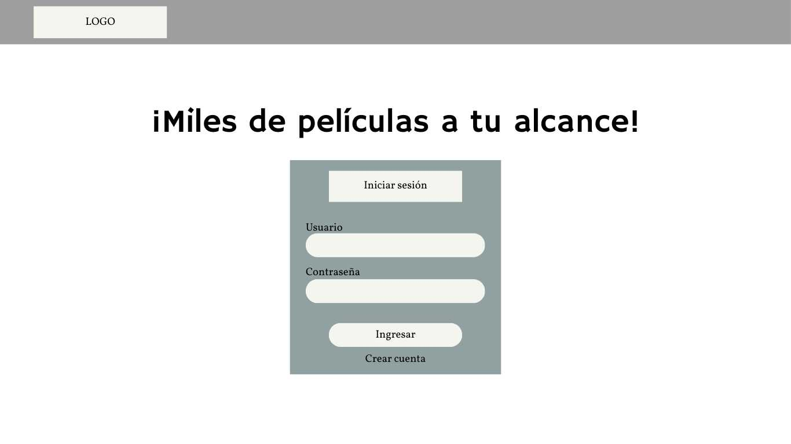
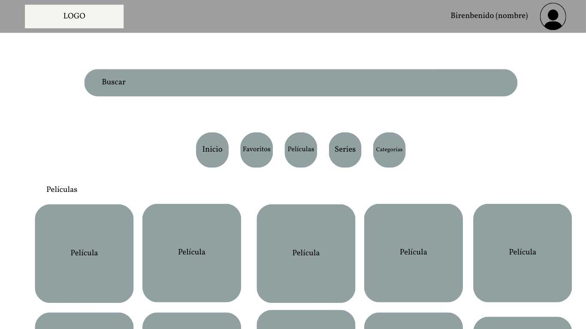
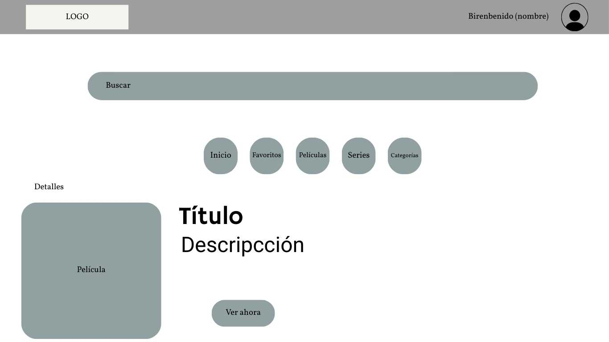
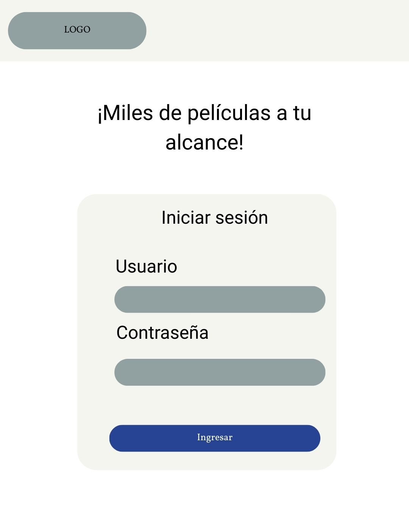
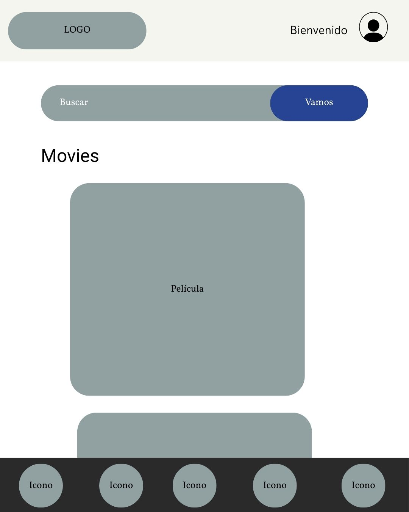
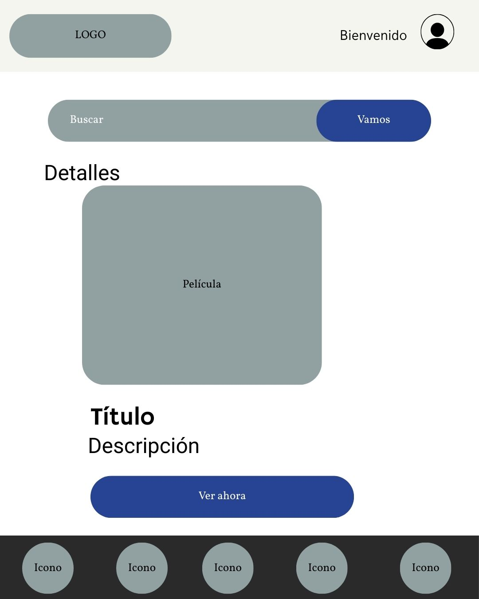

---

## 👀 Vista del proyecto

- Login
Una ventana de login sencilla en la que, para entrar, hay que tener un usuario ya creado e introducir las credenciales. El esquema de estilos esta inspirado en el Glassmorphism. Para cerrar sesión es necesario dar click en el ícono de usuario en la esquina superior derecha

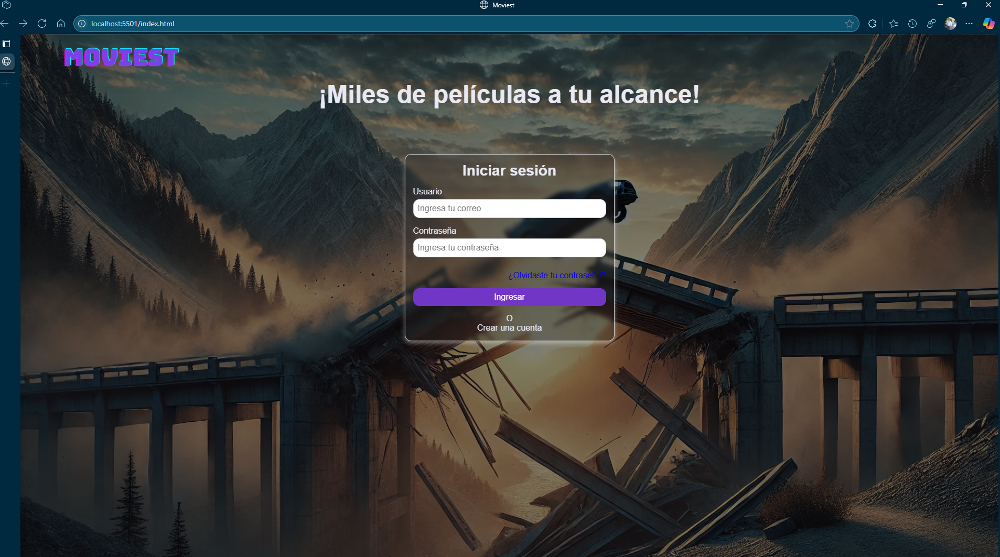

- Crear cuenta
Una ventana dedicada a crear una cuenta para usuarios nuevos (obligatorio llenar todos los campos)

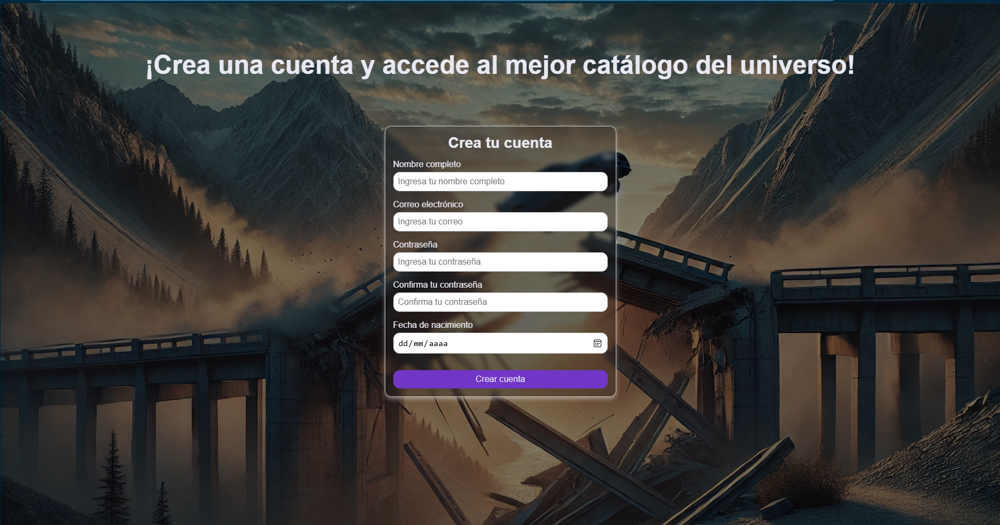

- Recuperar contraseña
Una ventana dedicada a recuperar contraseña (de momento sin funcionalidad por temas de seguridad)

- Home
El home consta de las secciones principales:
  - header que muestra el logo, un icono de buscar y un mensaje de bienvenida al usuario
  - una barra de búsqueda con alta visibilidad, pues se espera que en futuras iteraciones sea un
   punto importante para la navegación en la app
  - menú de navegación, este funciona como sistema de navegación para clasificar el contenido en distintas categorías predefinidas
  - Sección de películas, esta sección muestra una lista de películas en las cuales puedes ver detalles agregar o quitar de favoritos en base a los iconos    dispuestos en cada tarjeta
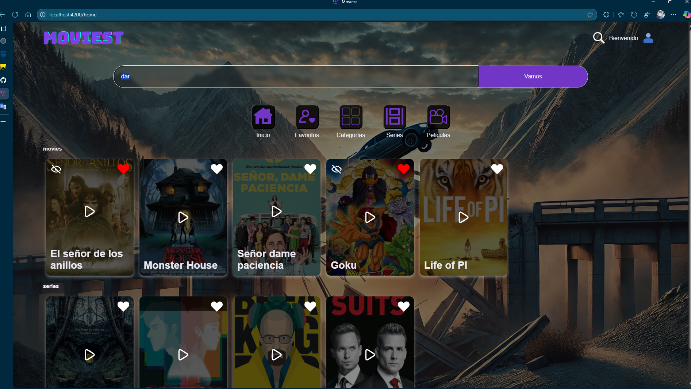

- Favoritos
se accede dando click en el icono de favoritos en el menu de la web, esta muestra películas o series que el usuario haya agregado previamente dando click en el icono del corazón de su respectiva tarjeta, también es posible eliminarlas dando click en el icono de ocultar en la misma tarjeta

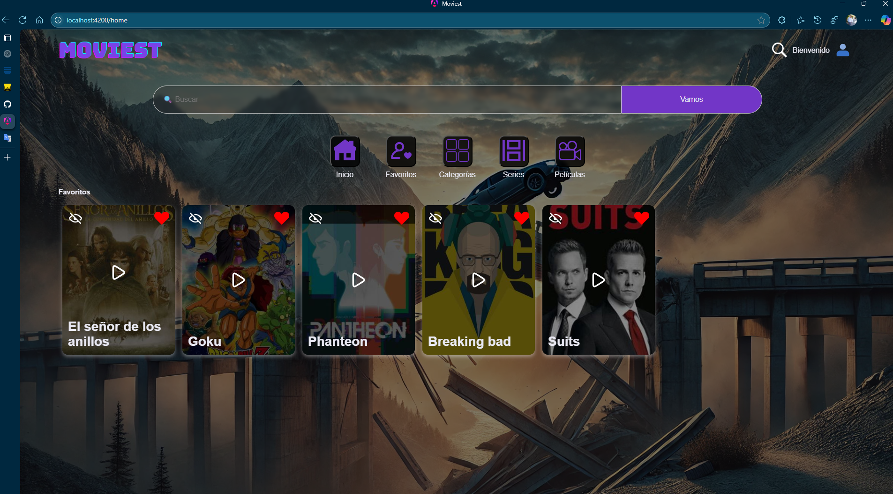

- Categorías
Se accede dando click al icono de categorías y este muestra todas las películas y series según su categoría
actualmente existen las categorías de
  - Acción
  - Misterio
  - Comedia
  - Drama
  - Ciencia Ficción
  - Suspenso

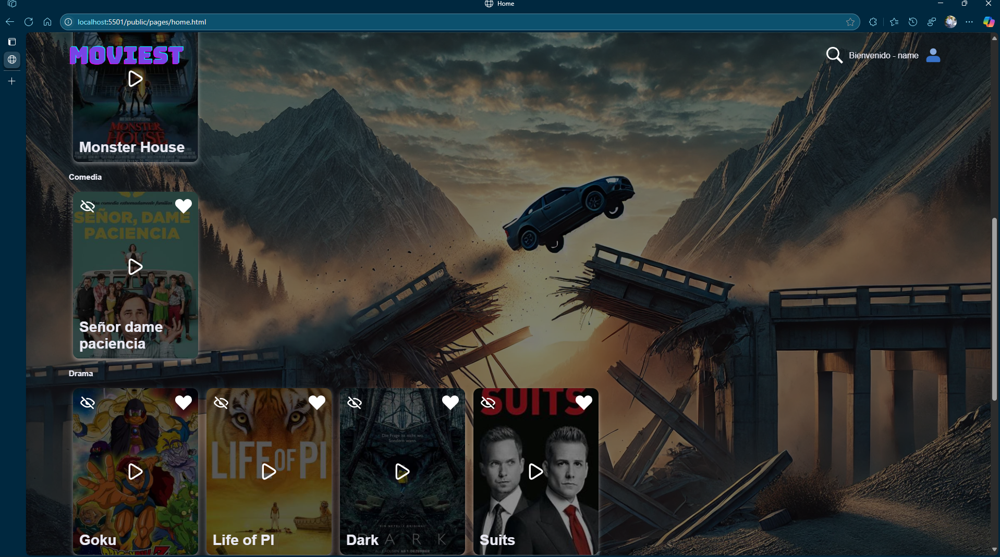

- Detalles de la película
Esta sección muestra los detalles de la película seleccionada, para poder acceder a esta sección hay que hacer click en el icono de la película que se desean conocer los detalles
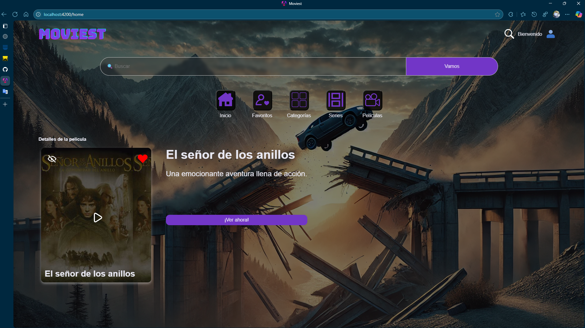
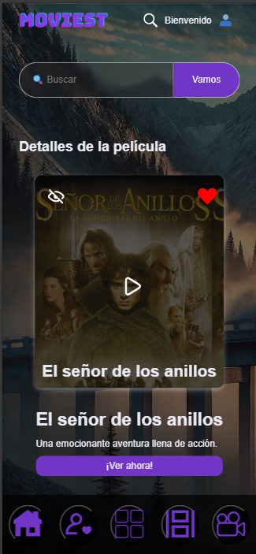

- Barra de búsqueda
Esta sección muestra los resultados de una búsqueda con coincidencias ya sea por titulo o descripción
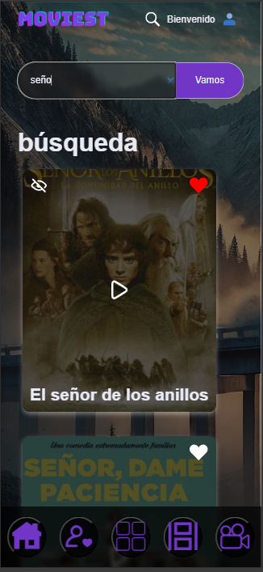

---

## 🛠️ ¿Como lo hice?

1. Cree un guard para manejar los inicios de sesión.
3. Modifique la lógica de los métodos que consumían el JSON hardcodeado para usar la API
4. Para la lógica de favoritos evalué distintas opciones para manejar los recursos, opte por hacer una solo una petición de los Ids de las películas guardadas en favoritos para compararla con los Ids de las películas cargadas y asi darle dinamismo a los iconos que manejan la UX de favoritos
5. ajuste las llamadas a los métodos modificados en el HTML
6. Cree una interface para el obserbable de favoritos para no usar el tipo 'any'
7. agregue un método para cerrar sesión y borrar el token, puedes hacerlo al hacer click en el icono de usuario a la derecha del header (se espera agregar un menu desplegable para mejorar la UX)

---

## 🐞 Errores conocidos

1. No hay algún elemento de UX para retroceder las listas de películas una vez realizada una búsqueda (se tiene que dar click en algún icono del nav-menu)
2. Solo existe un video hardcodeado para todas las películas
3. Se tuvieron que crear dos estructuras de interfaces para las películas, una para categorías y otra para las demás, lo cual no obedece las mejores practicas
4. no hay test para los nuevos métodos modificados

---

## Bibliotecas y dependencias utilizadas

- Rxjs 7.8.0
- typescript-eslint 8.27.0
- eslint 9.23.0
- karma 6.4.0
- angular/common/http 18.2.0 (no logre encontrar el paquete de http en el package.json por que creo que este viene dentro de @angular/common asi que puse la version que esta biblioteca indicaba)

## Reporte de code coverage

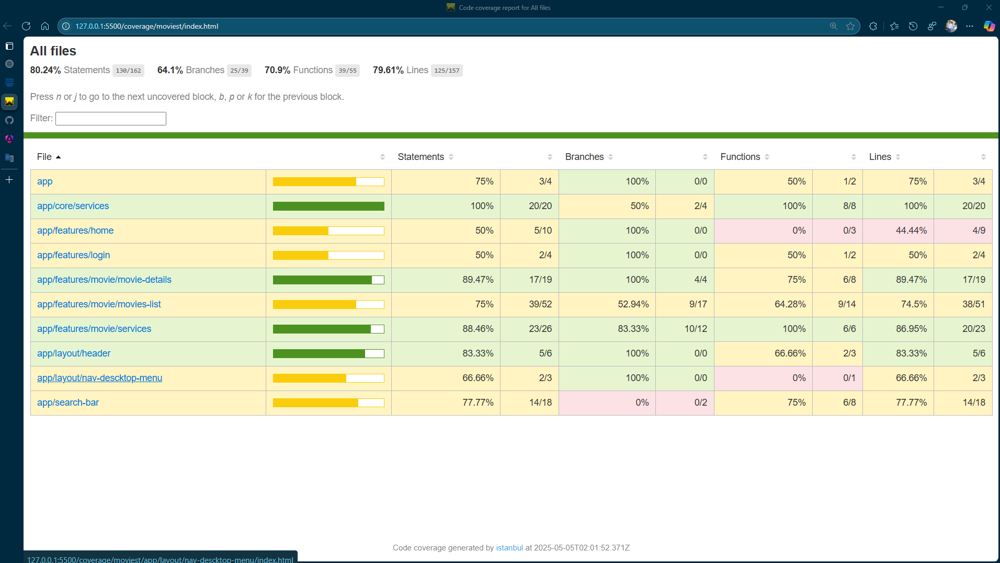
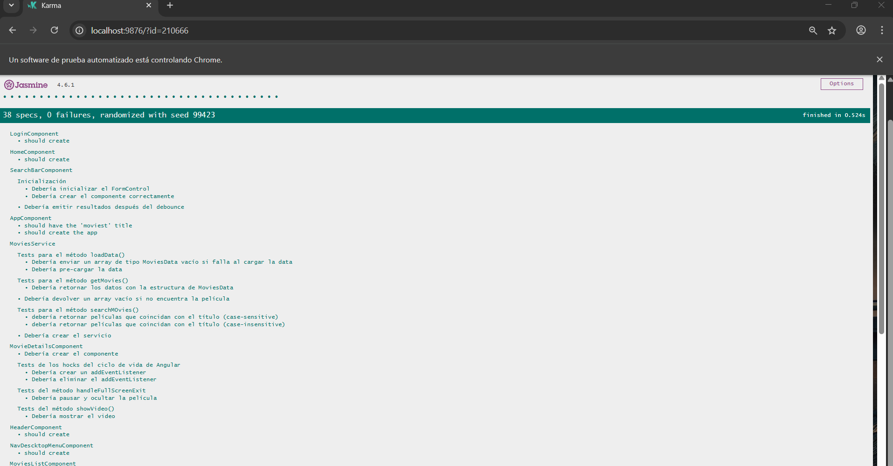

 Coverage summary  

- Statements   : 80.24% ( 130/162 )  
- Branches     : 64.1% ( 25/39 )  
- Functions    : 70.9% ( 39/55 )  
- Lines        : 79.61% ( 125/157 )  

---
