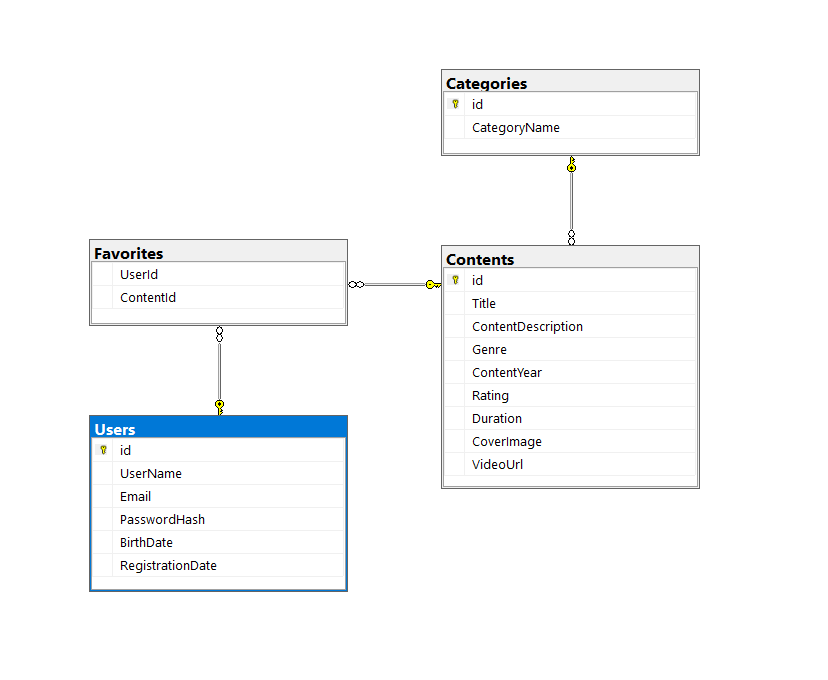

# Documentación Base de Datos Moviest_DB

## Tablas

---

### Categories

```sql
CREATE TABLE dbo.Categories
(
    id INT IDENTITY(1,1) NOT NULL,
    CategoryName NVARCHAR(50) NOT NULL,

    CONSTRAINT PK_Categories PRIMARY KEY (id),
    CONSTRAINT UQ_Categories_Name UNIQUE (CategoryName)
);
```

---

### Contents

```sql
CREATE TABLE dbo.Contents
(
    id INT IDENTITY(1,1) NOT NULL, 
    Title NVARCHAR(150) NOT NULL, 
    ContentDescription NVARCHAR(MAX) NULL,
    Genre INT NULL,
    ContentYear DATE NULL,
    Rating DECIMAL(2,1) NULL,
    Duration TIME NULL,
    CoverImage NVARCHAR(300) NULL,
    VideoUrl NVARCHAR(300) NULL,

    CONSTRAINT PK_Contents_Table PRIMARY KEY (id),
);
```

---

### Users

```sql
CREATE TABLE dbo.Users
(
    id INT IDENTITY(1,1) NOT NULL,
    UserName NVARCHAR(200) NOT NULL,
    Email NVARCHAR(200) NOT NULL,
    PasswordHash NVARCHAR(256) NOT NULL,
    BirthDate DATE,
    RegistrationDate DATETIME2 DEFAULT SYSDATETIME(),

    CONSTRAINT PK_Users PRIMARY KEY (id),
    CONSTRAINT UQ_Email UNIQUE (Email),
);
```

---

### Favorites

```sql
CREATE TABLE dbo.Favorites
(
    UserId INT NOT NULL,
    ContentId INT NOT NULL,
);
```

---

### Relaciones (Foreign Keys)

```sql
ALTER TABLE Favorites
ADD CONSTRAINT FK_Favorites_Users
    FOREIGN KEY (UserId)
    REFERENCES Users(id);

ALTER TABLE Favorites
ADD CONSTRAINT FK_Favorites_Contents
    FOREIGN KEY (ContentId)
    REFERENCES Contents(id);

ALTER TABLE Contents
ADD CONSTRAINT FK_Contents_Categories
    FOREIGN KEY (Genre)
    REFERENCES Categories(id);
```

---

## Diagrama Entidad Relación


